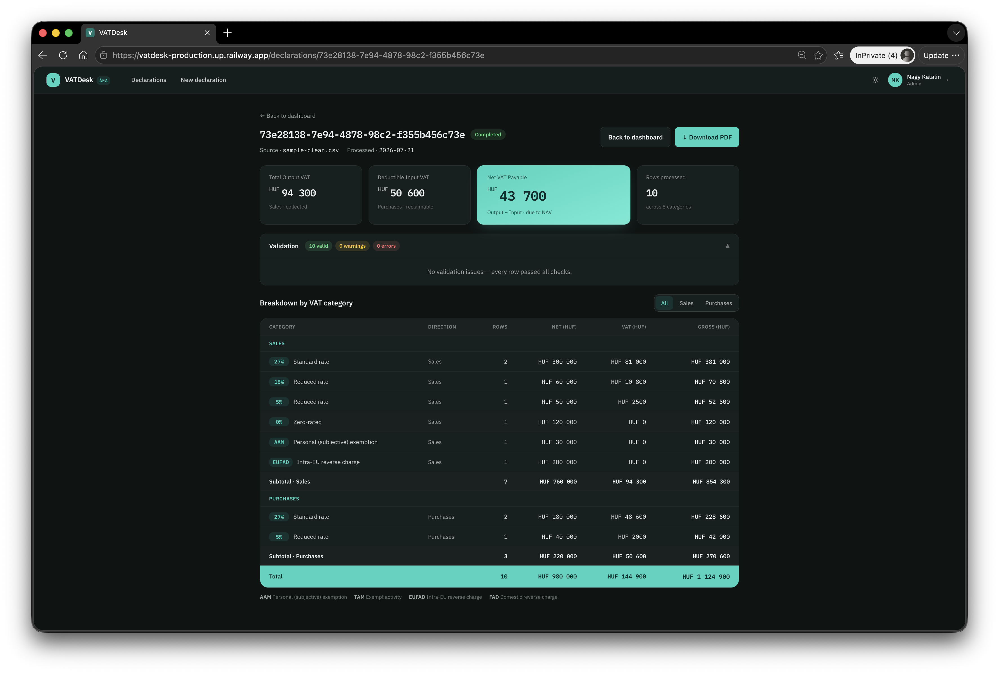

# VATDesk

Hungarian VAT (ÁFA) declaration generator. Upload an invoice export (CSV or NAV
3.0-style XML), VATDesk validates every row against the Hungarian VAT rule set,
aggregates amounts by VAT category, and produces a review-ready declaration summary —
on screen and as a PDF.



## Try it now

**Live demo: <https://vatdesk-production.up.railway.app>**

Demo credentials (seeded, real hashed-password accounts — not a fake login):

| Role | Email | Password |
|---|---|---|
| Admin (upload + view + PDF) | `admin@demo.hu` | `Admin123!` |
| Viewer (view + PDF only) | `viewer@demo.hu` | `Viewer123!` |

1. **Log in** as `admin@demo.hu`.
2. **Upload the built-in sample** — click "New declaration," then "Use sample .csv" (no
   file to find or download first; it fetches the canonical sample directly). A
   "Download sample .csv / .xml" link is also on the upload page if you want the file
   itself.
3. **View the report and download the PDF.** For `sample-clean.csv` the report should
   show exactly:

   | | |
   |---|---|
   | Total Output VAT | **HUF 94 300** |
   | Deductible Input VAT | **HUF 50 600** |
   | Net VAT Payable | **HUF 43 700** |
   | Rows processed | **10**, across **8** categories |

   Those are golden values, not approximations — they're asserted byte-for-byte in the
   automated test suite (see [Testing approach](#testing-approach)) and this is the
   quickest way to confirm the deployment is computing correctly.

## Run locally

```bash
cp .env.example .env
# edit .env and set JWT_KEY to a real generated value:
#   openssl rand -base64 48
docker compose up --build
```

Starts PostgreSQL and the app (API + built React frontend, served together) at
`http://localhost:8080`. `GET /api/health` reports app version and DB connectivity.
Same demo credentials as above. Sample files live in
`.claude/skills/hungarian-vat/assets/` (the single source of truth — served to the app
via `GET /api/samples/*`, never duplicated elsewhere in the repo).

`.env` is required — there is no built-in fallback signing key. The app fails fast at
startup with a clear error if `JWT_KEY` is missing or shorter than 32 bytes.

For frontend hot-reload during development, run the API and the Vite dev server
separately:

```bash
dotnet run --project src/VatDesk.Api
cd frontend && npm install && npm run dev
```

The Vite dev server proxies `/api/*` to the API (`frontend/vite.config.ts`).

### Environment variables

| Variable | Required | Purpose |
|---|---|---|
| `JWT_KEY` | yes | HS256 signing key, ≥ 32 bytes. No default — generate with `openssl rand -base64 48`. |
| `POSTGRES_USER` / `POSTGRES_PASSWORD` / `POSTGRES_DB` | no (demo defaults) | Local-only Postgres credentials; not internet-facing. |

These are the friendly names `docker-compose.yml` expects locally — deploying without
compose needs the actual double-underscore config keys set directly. See
[docs/DEPLOYMENT.md](docs/DEPLOYMENT.md) for the full story, including the two real
gotchas hit deploying to Railway.

## Architecture

Layering is enforced by project references, one direction only:

```text
┌──────────────────────────┐
│   frontend/ (React/Vite)  │  served as static files by the API in prod
└─────────────┬─────────────┘
              │ HTTP (/api/*)
┌─────────────▼─────────────┐
│      VatDesk.Api           │  controllers, JWT auth, DTOs — thin, no business logic
├─────────────┬─────────────┤
│  VatDesk.Infrastructure    │  EF Core/Postgres, CSV+XML parsers, PDF, per-country
│                             │  registries & strategies
├─────────────┬─────────────┤
│      VatDesk.Core          │  models, abstractions, validation (V1–V8) — zero
│                             │  external dependencies
└─────────────────────────────┘
```

`Core` never references EF, ASP.NET, QuestPDF, or a parser library. Controllers
delegate; all aggregation math lives in the country strategy. Full layout, persistence
schema, and API surface: [`.claude/skills/hungarian-vat/references/architecture.md`](.claude/skills/hungarian-vat/references/architecture.md).

### Adding a country

Country support is a pluggable seam: `IVatCategoryRegistry` + `IVatDeclarationStrategy`,
registered per country code (`AddCountry<TRegistry, TStrategy>("XX")`,
`src/VatDesk.Api/Extensions/DomainServiceCollectionExtensions.cs`). Hungary (`HU`) is
the only implemented country in v1. Adding one means a new
`Infrastructure/Countries/Xx/` registry + strategy, one DI registration line, and sample
fixtures with golden values — no changes needed in `Core`, controllers, parsers, or the
React components. Full recipe: [the skill's "how to add a country" section](.claude/skills/hungarian-vat/references/architecture.md#how-to-add-a-country-the-extensibility-recipe--keep-this-working).

## Security

Hardened against an 11-point checklist (upload limits, XXE defense, invariant-culture
decimal parsing, JWT auth, server-enforced role authorization, rate limiting, CORS,
security headers, generic error responses, CSV-export formula-injection awareness,
secrets-in-env-vars-only) — all 11 items Implemented or N/A, each with evidence, not
just asserted. Full verdict table, two additional audits (declaration-id enumeration
reasoning, dependency scan results), and the documented accepted-risk list (demo
credentials by design, JWT in `sessionStorage`, no multi-tenancy, and others):
[**docs/SECURITY.md**](docs/SECURITY.md).

## Testing approach

**Automated: 93 passing tests** (`dotnet test`), all integration tests booting the real
`Program` via `WebApplicationFactory` — no mocked HTTP pipeline. Coverage by area:

- **Validation rules V1–V8**: one dedicated test file per rule (`tests/.../Validation/`),
  V1 (required/well-formed fields) covered within the parser tests since it's not a
  separate downstream rule.
- **Parser fixtures**: CSV and NAV 3.0 XML parsers, both against the skill's canonical
  sample files, plus format-detection (`ParserFactory`) edge cases.
- **Golden-value aggregation**: `HungarianVatDeclarationStrategyTests` and
  `HungarianVatCategoryRegistryTests` assert the exact totals in
  [`data-contract.md`](.claude/skills/hungarian-vat/references/data-contract.md#6-golden-values-for-assetssample-cleancsv) —
  the same numbers this README's walkthrough asks you to verify by eye.
- **XXE rejection**: a malicious `<!DOCTYPE>`/external-entity payload asserted to fail
  parsing, not silently succeed.
- **AuthZ**: anonymous → 401, wrong role → 403 (e.g. Viewer on the Admin-only upload
  endpoint), correct role → 200, exercised as real HTTP calls through the auth
  middleware, not unit-tested in isolation.
- **Integration golden path**: upload → persist → fetch → PDF render, end to end.
- **Security-specific**: rate-limit thresholds, response headers present on real
  responses, the fail-fast JWT-key startup guard.

**Manual verification**, done after every major change against a real local Postgres
via `docker compose up` — not simulated: log in → upload `sample-clean.csv` and
`sample-invalid.csv` → verify totals/warnings/status chip match the golden values and
expected rule ids → download and open the PDF. Browser-level checks (screenshots,
network tab, console errors) via Playwright for anything the automated suite can't
observe (visual layout, actual header values on live responses).

**Honestly missing**: no CI pipeline — tests are run locally, not on every push. No
automated end-to-end/browser test suite committed to the repo (the Playwright checks
described above were ad hoc verification scripts run during development, not retained
as a maintained suite). Both listed under [Future improvements](#future-improvements).

## AI-assisted workflow

This project was built end-to-end with Claude, across a planning session and many
Claude Code sessions.

**Planning**: a dedicated Claude session did the requirements analysis, NAV 3.0
XML/Hungarian VAT domain research, architecture decisions, and the data contract —
exported as part of the AI log (see [Deliverables](#deliverables-map)).

**Custom project skill** — [`.claude/skills/hungarian-vat/`](.claude/skills/hungarian-vat/):
encodes the domain rules (VAT category registry, validation rule set V1–V8, the CSV/XML
data contract), architecture conventions, and the canonical sample files, so every
subsequent Claude Code session works from the same ground truth instead of
re-deriving or drifting on field names, codes, or tolerances between sessions.

**UI design**: generated in Claude Design from a written design prompt
(`docs/design/`), synced into the implementation via the Claude Design MCP.

**Implementation**: Claude Code, one prompt per phase or vertical slice (backend
domain → auth → upload flow → report view → security audit → two pure refactors →
Railway deployment → this documentation pass), each with explicit acceptance criteria
the session verified itself before moving on. Conventional commits mirror the phases —
the commit history is a readable timeline of the same plan tracked in
[`docs/PLAN.md`](docs/PLAN.md).

**MCPs actually used**: Claude Design (UI sync), GitHub (repo operations), and Railway
(deployment inspection and configuration, added mid-project for Phase 7 — see
[docs/DEPLOYMENT.md](docs/DEPLOYMENT.md)). This list was corrected during this
documentation pass: an earlier draft of the project plan also named a Postgres MCP with
no evidence it was ever configured or used — removed rather than carried forward
unverified once asked and confirmed.

**The prompting approach itself**, since it's as much a part of the submission as the
code:

- **Repo-as-context**: `CLAUDE.md` (hard rules, workflow conventions) + the project
  skill (domain rules) + `docs/PLAN.md` (living plan, phase status, decision log) are
  read at the start of every non-trivial session, not re-explained each time.
- **Skill wins on conflict**: where the design mockup or a prompt's assumption
  contradicted the skill's locked data contract or category registry, the skill won —
  documented explicitly rather than silently reconciled (see `docs/PLAN.md`'s "Design
  gaps" section for every instance).
- **Audit-before-fix**: the security hardening session produced a full verdict table
  against the 11-point checklist *before* changing any code, so every fix was a
  deliberate, separately-committed response to a named gap — not an undirected pass.
- **Pure-refactor discipline**: both the axios migration and the `Program.cs`
  decomposition were scoped as behavior-preserving only, proven by the full test suite
  staying green (same count, before and after) plus live verification — pre-existing
  issues found along the way were listed, not silently fixed inside the diff.
- **Evidence-based documentation** (this session): every claim in this README and the
  linked docs is traceable to code, a commit, or something confirmed directly — ambiguous
  claims (like the MCP list above) were asked about rather than assumed.

## Deliverables map

| Deliverable | Location |
|---|---|
| Running deployment | <https://vatdesk-production.up.railway.app> (see [Try it now](#try-it-now)) |
| GitHub repository | <https://github.com/cretumarius/VATDesk> |
| AI conversation log | [`docs/ai-log/`](docs/ai-log/) — planning session + Claude Code session exports, unedited |
| README | this file |

## Future improvements

- **Phase 4.4 filters**: the declarations table has no search/filter/sort control (see
  `docs/PLAN.md`'s 4.4 note) — descoped for the challenge timebox, not forgotten.
- **Microsoft Entra ID login**: planned as a stretch goal from the start; the seeded
  JWT auth was the baseline that shipped.
- **CI pipeline**: tests run locally only; no GitHub Actions (or similar) running them
  on push/PR.
- **Automated E2E suite**: manual + ad hoc Playwright verification only, not a
  maintained, committed browser test suite.
- **TanStack Query** (or similar): the axios refactor added a minimal hand-rolled cache
  deliberately scoped to two endpoints; a real data-fetching library would generalize
  that if the app grows.
- **Romanian VAT strategy**: the extensibility seam (`IVatCategoryRegistry` +
  `IVatDeclarationStrategy`) exists and is exercised by exactly one country; Romania was
  the planned reference case for a second (see `docs/PLAN.md`'s locked decisions —
  current RO rates would need verifying at implementation time, not assumed from
  training data).
